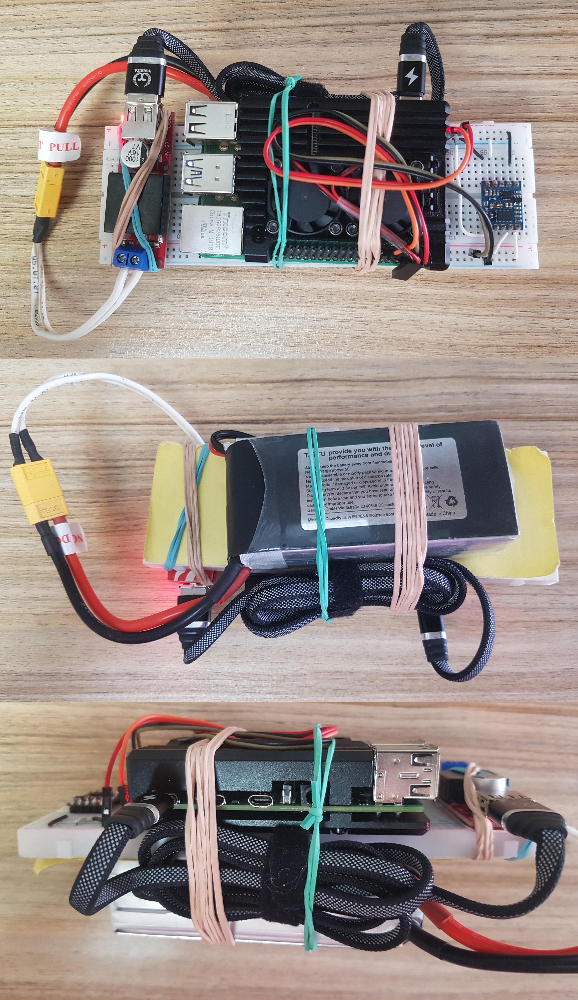

# **Implementation of a Regression Models(Deep-RNN Model + Support-Vector-Regression + K-Neighbours-Regression) for Navigation Against Kalman Filters for the Calculation of Quaternions and Euler Angles**

### This Repo Contains 2 Main Parts:

* [Dataset](https://github.com/BanaanKiamanesh/DL_for_Navigation/tree/main/DataSet)
*   1. [DRNN Model](https://github.com/BanaanKiamanesh/DL_for_Navigation/tree/main/RNN%20Model)
    2. [SVR+KNR Model](https://github.com/BanaanKiamanesh/DL_for_Navigation/tree/main/SVR%20Model)

## DataSet Collection

#### Data Contains

    1. Gyroscope Data 3DoF
    2. Accelerometer Data 3DoF
    3. Magnetometer Data 3DoF
    4. Euler Angles Data 3DoF
    5. Quaternions Data 4DoF

To collect the data, I made a small setup using a Raspberry pi and BNO055 IMU. So simple but it works wonderfully.

### 1. Hardware Setup

    1. Raspberry pi 4
    2. BNO055 9DoF IMU
    3. Lithium Polymer Battery
    4. Buck Converter
    5. USB-C to USB-A Adapter
    6. Breadboard
    7. Bunch of Jumper Wires
    > **Note:** It should be portable, So the data collection is not constrained to a specific location and angle.

---

### 2. Software Setup

[Here](https://github.com/BanaanKiamanesh/DL_for_Navigation/tree/main/Data_Collection) is the code for the data collection.
First, the code is written in C++. The code contains a loop with a constant frequency of 100Hz. The loop reads the IMU data for 5 minutes and writes it to a ".csv" file at each iteration.

There is a Executable file for the Code in the same folder.
But in case you want to run the code, you need to install the WiringPi library from [here](http://wiringpi.com/download-and-install/).

There is another prerequisite for the code to run.
High speed I2C (400kHz) in the used Raspberry pi 4 have to be anabled.
For the purpose use the procedure described in the [here](https://www.raspberrypi-spy.co.uk/2018/02/change-raspberry-pi-i2c-bus-speed/).

After handling all, the code is ready to be compiled.

So, Navigate to the folder where the code is and ***run*** the following ***bash*** command:

    $ g++ -o CollectorApp *.cpp -lwiringPi -lm -std=c++11

***Now the executable file is ready to be run like this***:

    $ ./CollectorApp

---

#### **There are 8 Available Files Containing Data in the *"DataSet"* Folder.**

> **Note:** The files having "(No Mag)" in there names, don't contain magnetometer data.
---

## **Models**
For the purpose of this project, I used the following models:
* Deep-RNN Model
* Support-Vector-Regression Model
* K-Neighbours-Regression Model

Seems Like the Complexity of the data is so much that the ***RNN Model*** is not able to handle it.

And it had a huge RMS of ***0.5*** in it's predictions and also the model stopped learning after a few epochs. Although the learning rate was adaptively adjusted. 

So, I decided to use the ***Multi Output Support Vector Regression*** model.
Which seemed to handle the data better.
But, also the Model didn't perform well enough!

So, as a last resort, I used the ***K-Neighbours Regression*** model. Which turned out to be the finest model for this data...

And with a bit of tuning, it was able to perform the best on the data.
with a mean absolute error of ***0.0043*** for Quaternions and ***3.3*** for Euler Angles.

 > (**Note:** The mean absolute error is the average of the absolute errors of the predictions)
---
#### Logs for all the models are saved in a file named "Logs.txt" in the specific folder of each model.